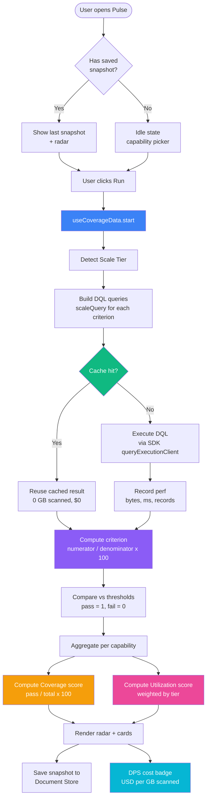
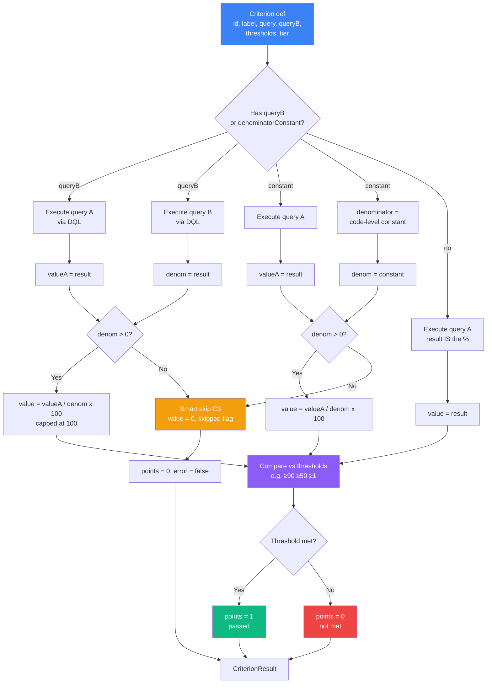
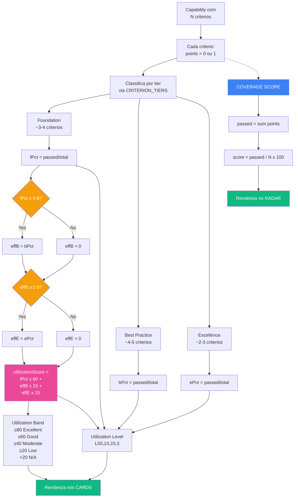
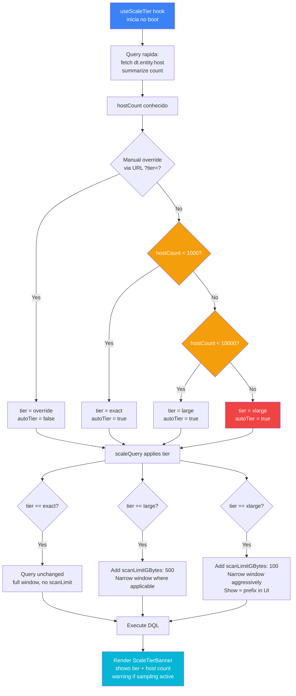
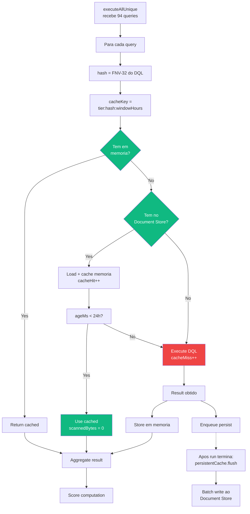
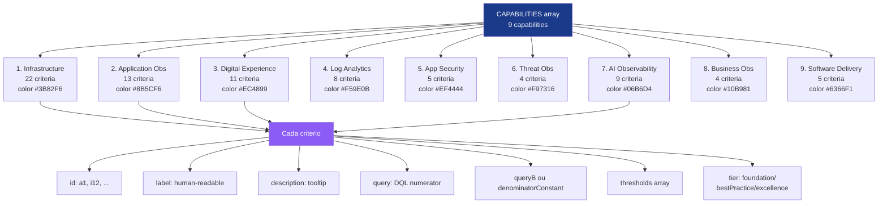
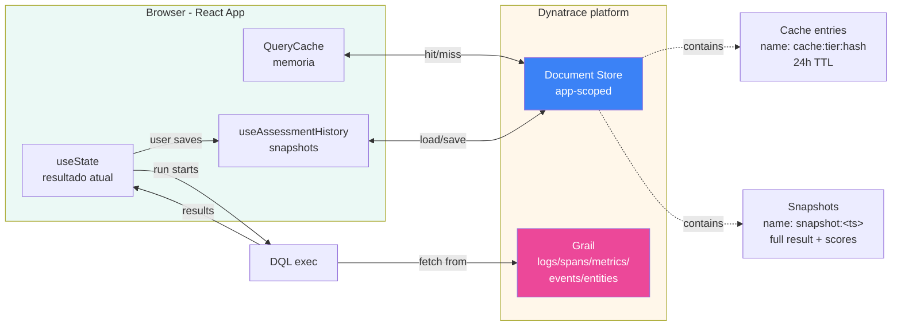
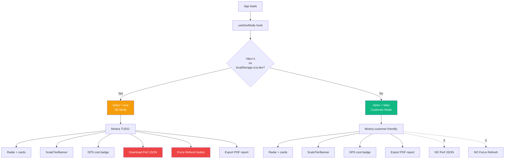
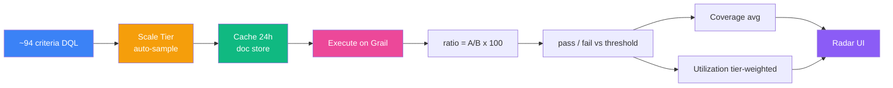

# Pulse Assessment - Architecture & Logic Diagrams

Diagramas em **Mermaid** cobrindo a logica do app v2.5.5. Visualizam no GitHub, GitLab, VS Code (preview), Obsidian, ou qualquer renderer Markdown.

Para exportar como imagem: `npx @mermaid-js/mermaid-cli -i ARCHITECTURE-DIAGRAM.md -o diagram.png`.

---

## 1. Visao geral - fluxo do usuario

Do clique em "Run Assessment" ao radar final.



---

## 2. Camadas da aplicacao

Como o codigo se organiza por responsabilidade.

```mermaid
flowchart LR
    subgraph UI["Presentation"]
        direction TB
        APP[App.tsx<br/>routes + ErrorBoundary]
        PAGES[pages/<br/>CoverageAssessment<br/>ComparisonPage]
        COMP[components/<br/>TechRadar - canvas<br/>CapabilityCards<br/>DpsCostBadge<br/>ScaleTierBanner]
    end

    subgraph HOOKS["Hooks - state + side effects"]
        direction TB
        UCD[useCoverageData<br/>orchestrates queries]
        UST[useScaleTier<br/>auto-detects host count]
        UDM[useDevMode<br/>SE gating ?dev=1]
        UAH[useAssessmentHistory<br/>Document Store CRUD]
    end

    subgraph LOGIC["Domain logic"]
        direction TB
        QRY[queries.ts<br/>~94 criteria + thresholds]
        TIERS[criterionTiers.ts<br/>tier classification]
        ST[scale-tier.ts<br/>tier decision rules]
        UTIL[utils/colors.ts<br/>SCORE_BANDS]
    end

    subgraph PERF["Performance"]
        direction TB
        CACHE[queryCache.ts<br/>24h Doc Store cache]
        REPORT[buildReport.ts<br/>perf JSON export]
        TYPES[types.ts<br/>PerfReport schema]
    end

    subgraph SDK["Dynatrace SDKs"]
        direction TB
        QEC[queryExecutionClient<br/>DQL -> Grail]
        DOC[client-document<br/>persistence]
    end

    UI --> HOOKS
    HOOKS --> LOGIC
    HOOKS --> PERF
    HOOKS --> SDK
    PERF --> SDK

    style UI fill:#3B82F615
    style HOOKS fill:#8B5CF615
    style LOGIC fill:#10B98115
    style PERF fill:#F59E0B15
    style SDK fill:#EC489915
```



---

## 3. Como cada criterio vira um numero

A operacao basica que se repete 94 vezes.



**Exemplo real (i1 - Host CPU coverage):**

```
query  = timeseries val=avg(dt.host.cpu.usage), by:{dt.entity.host}
         | dedup dt.entity.host | summarize c=count()
queryB = fetch dt.entity.host | summarize count()

valueA = 87 (hosts com metrica de CPU)
denom  = 100 (total de hosts)
value  = 87 / 100 x 100 = 87%

thresholds = [{min: 90}, {min: 50}, {min: 1}]
87 >= 50 (passou threshold "medio") -> points = 1
```

---

## 4. Coverage vs Utilization - dois caminhos de agregacao

Mesmos 94 criterios, duas formulas diferentes.



**Regra progressiva** (chave da formula): Best Practice so conta se Foundation >= 80%. Excellence so conta se Best Practice >= 60%. Isso evita que cliente "pule passos" e tenha utilization inflada por criterios avancados sem ter o basico.

---

## 5. Decisao de Scale Tier (auto-detect)

Como o app decide rodar queries leves ou caras.



**Por que importa**: rodar o assessment inteiro contra um tenant de 80k hosts em modo `exact` escanearia ~10 TB e custaria ~$100 por execucao. xLarge tier cai para ~$20-30 com sampling estatistico (ainda preciso suficiente para o score).

---

## 6. Cache de queries (24h)

Por que rodar de novo se nada mudou no Grail?



**Numeros reais (v2.5.5, reference tenant, medidos em `dt.system.events`)**:
- Cold run **antes** do Economy Mode: ~370 GB scanned, ~$3.70
- Cold run **com** Economy Mode: ~41 GB scanned, ~$0.41
- Warm run (cache 24h): 0 GB scanned, $0
- Score: identico entre cold e warm; com Economy Mode os valores viram
  estimativas proximas (razoes +-1,5 pp, contagens distintas ~6% menores)

---

## 7. Estrutura de dados das 9 capabilities

Hierarquia completa do dominio.



**Total**: ~94 criterios, mas executa apenas as **queries unicas** (dedup por hash) - tipicamente ~70 queries efetivas porque muitos criterios reusam o mesmo denominador.

---

## 8. Persistencia e historico

Onde os dados vivem.



**Scopes necessarios** (em `app.config.json`):
- `storage:*:read` - acesso a Grail (logs, spans, events, metrics, entities, bizevents, buckets, system)
- `document:documents:read/write/delete` - cache e snapshots

---

## 9. Producao vs SE/Dev (gating)

O que cliente ve vs SE.



---

## 10. Resumo - o fluxo em uma frase



> **Em uma linha:** *94 razoes DQL contra o proprio tenant, sampled por tier, cacheadas 24h, comparadas a thresholds hardcoded, agregadas como media (coverage) ou ponderacao progressiva (utilization).*

---

## Como visualizar / exportar

1. **GitHub / GitLab** - abre nativo, ja renderiza
2. **VS Code** - extensao "Markdown Preview Mermaid Support" (id: `bierner.markdown-mermaid`)
3. **Obsidian** - nativo, copia o MD para o vault
4. **Exportar PNG/SVG**:
   ```bash
   npm i -g @mermaid-js/mermaid-cli
   mmdc -i docs/ARCHITECTURE-DIAGRAM.md -o docs/diagrams/ -e png
   ```
5. **Online** - cole em https://mermaid.live para editar interativamente

Versao: v2.5.5 | Atualize quando mudar regras de Scale Tier / Economy Mode, formula de utilization, ou estrutura de capabilities.
