# Pulse Assessment - Scoring Calculations (Coverage & Utilization)

Diagramas Mermaid detalhados explicando **exatamente como** Coverage e Utilization sao calculados, com exemplos numericos reais.

Source-of-truth do codigo:
- `ui/app/queries.ts` (linhas 284-286) - weights
- `ui/app/data/criterionTiers.ts` - classificacao por tier
- `ui/app/hooks/useCoverageData.ts` (linhas 706-766) - formula
- `ui/app/hooks/useCoverageData.ts` (linhas 852-870) - agregacao final

Versao: v2.5.5

---

## 1. Como um criterio vira 0 ou 1 (passo basico)

Cada um dos ~94 criterios passa pelo mesmo pipeline. O resultado e binario: **passou ou nao passou**.

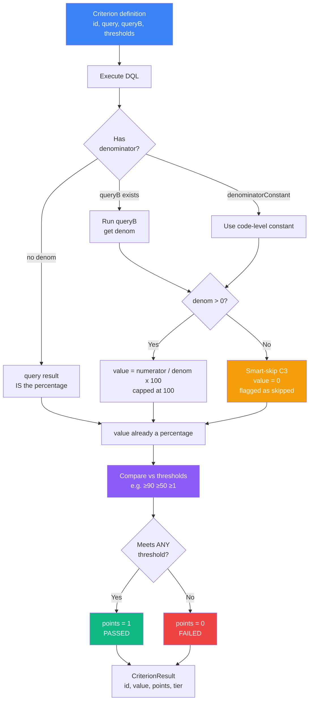

**Exemplo concreto - criterio i1 (Host CPU coverage):**

```
numerator query = timeseries val=avg(dt.host.cpu.usage), by:{dt.entity.host}
                  | dedup | summarize c=count()
                  -> returns 87 (hosts com metrica de CPU)

denominator query = fetch dt.entity.host | summarize count()
                    -> returns 100 (total de hosts)

value = 87 / 100 x 100 = 87%

thresholds = [{min: 90}, {min: 50}, {min: 1}]
             87 >= 50  -> meets threshold "medio"
             -> points = 1 (PASSED)
```

---

## 2. Coverage Score (formula simples)

A **media de criterios que passaram**, sem peso. E o numero que aparece no radar.

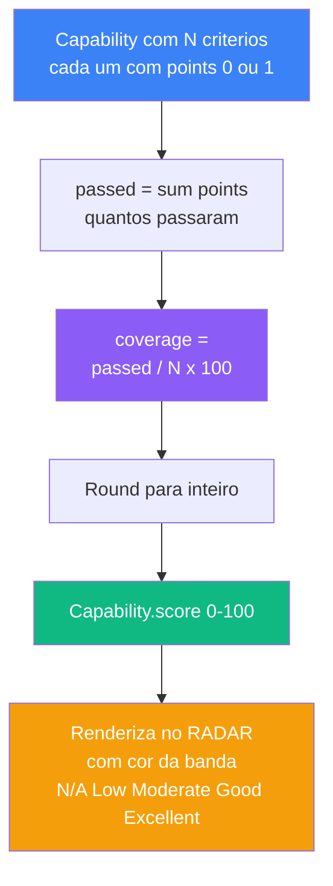

**Exemplo - Infrastructure Observability (22 criterios):**

```
Suponha que 14 dos 22 criterios passaram threshold:

coverage = 14 / 22 x 100
         = 63.6%
         -> Math.round(63.6) = 64

banda: "Good" (60-80)
cor radar: #5EB1A9
```

---

## 3. Utilization Score (formula ponderada progressiva)

Mesmos criterios, mas **agrupa em 3 tiers** e aplica **pesos com gates progressivos**.

### 3.1 Tier classification

Cada criterio e classificado em um dos 3 tiers em `criterionTiers.ts`:

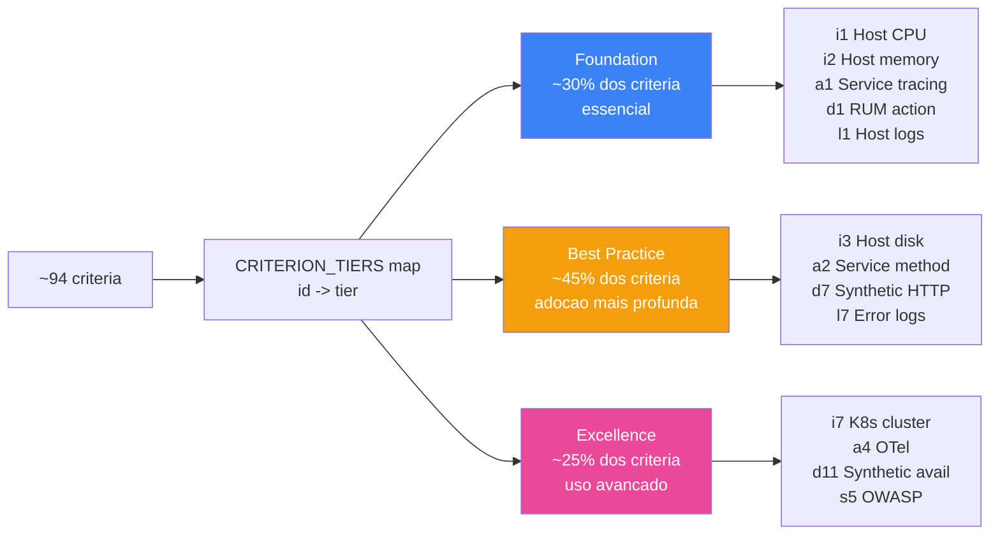

### 3.2 Calculo dos percentuais por tier

Para cada capability, conte quantos passaram em cada tier.

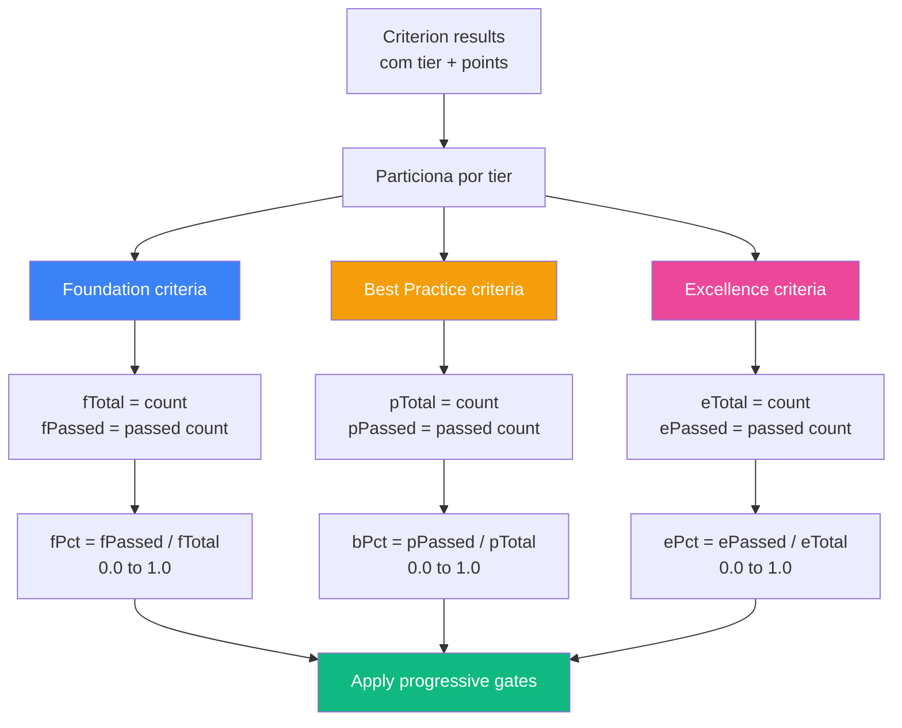

### 3.3 Gates progressivos (a magica)

Esta e a **regra-chave** que diferencia Utilization de uma simples media ponderada. BP e Excellence so contam se os anteriores estiverem solidos.

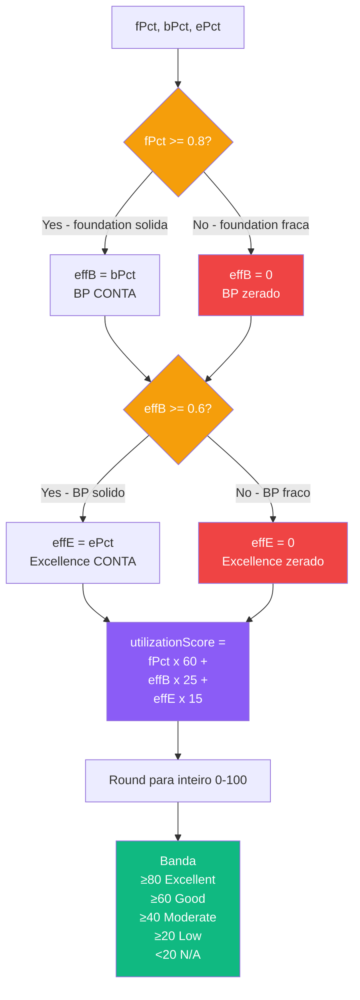

**Por que esses gates?** Porque um cliente pode acidentalmente passar em criterios Excellence (ex: tem OTel ativo) sem ter o basico (ex: nem todos os hosts com CPU). A formula sem gate inflaria a utilization. Os gates forcam:

- BP so importa se voce ja tem **80%+ do Foundation**
- Excellence so importa se voce ja tem **60%+ do BP** (que por sua vez exige Foundation forte)

### 3.4 Utilization Level (L0-L3) - rotulo discreto

Independente do utilizationScore, atribui um **nivel** discreto. Mais facil de comunicar.

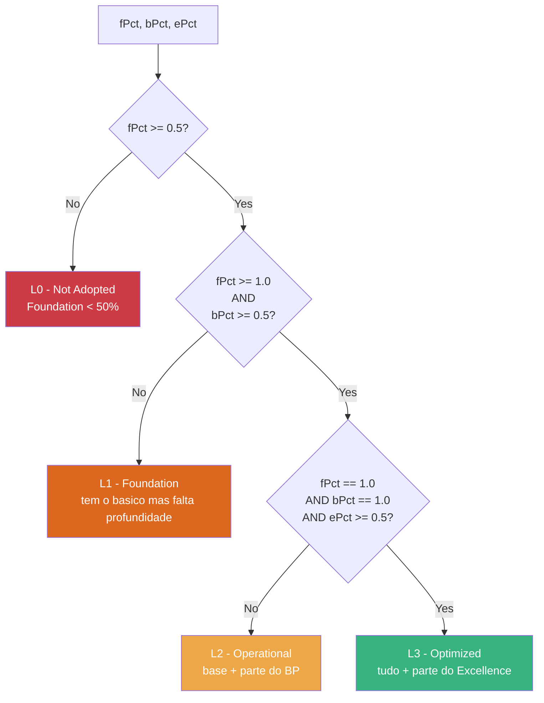

---

## 4. Exemplo numerico completo - Infrastructure capability

Vamos rodar uma capability inteira de ponta a ponta com numeros reais.

### Setup

**Infrastructure Observability** tem 22 criterios:
- **Foundation** (3): i1, i2, i4
- **Best Practice** (10): i3, i5, i6, i9, i11, i13, i14, i17, i19, i20, i21
- **Excellence** (8): i7, i8, i10, i12, i15, i16, i18, i22

Suponha estes resultados:
```
Foundation:    3/3  passed -> fPct = 1.00 (100%)
Best Practice: 6/11 passed -> bPct = 0.55 (55%)
Excellence:    3/8  passed -> ePct = 0.38 (38%)

Total passed: 12 / 22
```

### Coverage Score

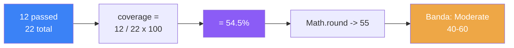

**Coverage = 55** (banda Moderate, cor amarela)

### Utilization Score

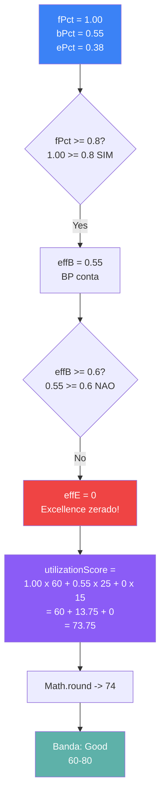

**Utilization = 74** (banda Good, mesmo com Excellence 38% - porque o gate cortou).

### Utilization Level

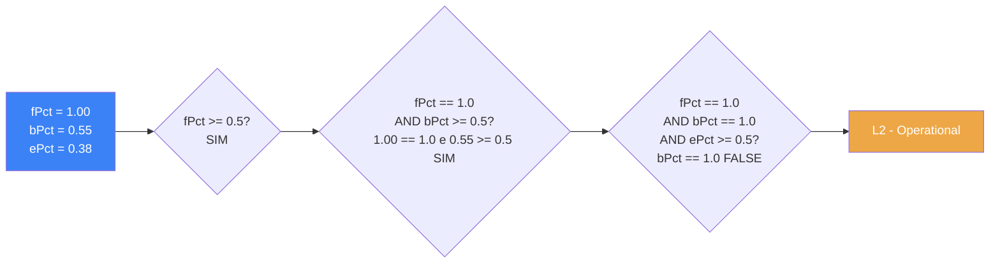

**Nivel = L2 Operational**

### Resumo do exemplo

| Metrica | Valor | Significado |
|---|---|---|
| Total criterios | 22 | tudo que esta sendo medido |
| Passaram | 12 | metade-ish |
| **Coverage** | **55** | "55% dos itens passou" |
| **Utilization** | **74** | "base solida, BP a meio caminho, Excellence ignorado" |
| **Level** | **L2 Operational** | "tem o basico + alguma profundidade" |

Note como **Coverage 55 < Utilization 74**: o cliente tem Foundation 100%, e a formula de Utilization premia isso. Coverage trata todos os criterios como iguais.

---

## 5. Coverage vs Utilization - lado a lado

Quando os dois numeros divergem, o por que.

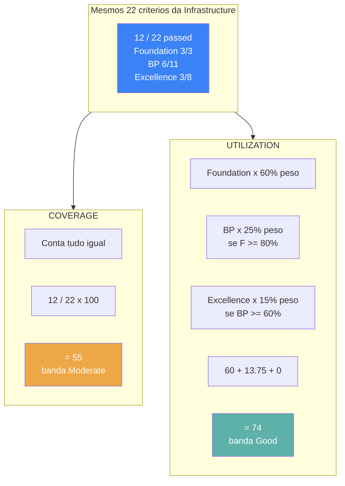

**Cenarios em que os dois numeros divergem mais:**

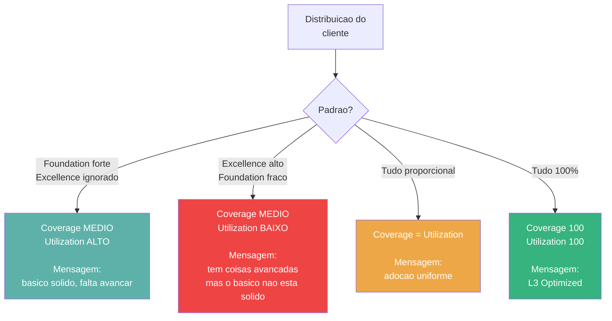

---

## 6. Total Score - agregando as 9 capabilities

O numero unico que aparece no header.

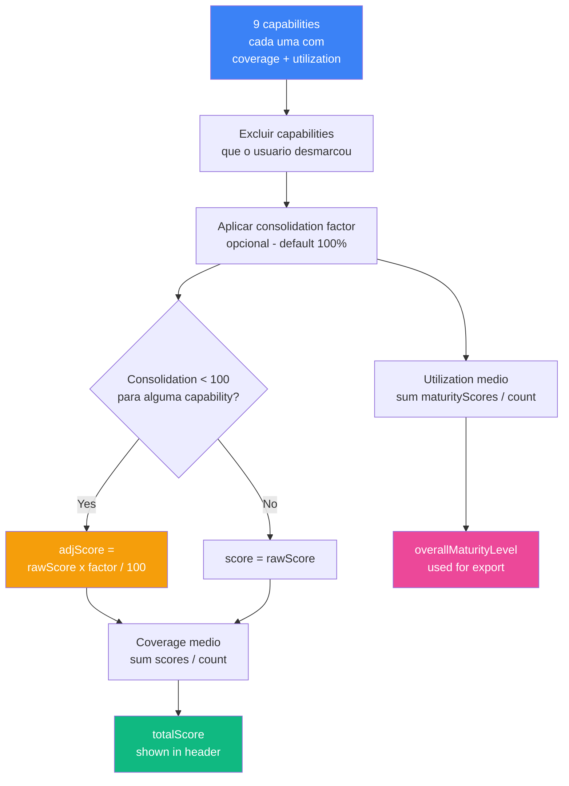

**Consolidation factor** e um ajuste manual por capability (0-100%) que o SE pode setar quando sabe que algumas capabilities nao se aplicam ao cliente (ex: cliente sem K8s -> Infrastructure deveria pesar menos). Default e 100% (sem ajuste).

---

## 7. O que muda o score (e o que nao muda)

Resumo do que afeta cada metrica.

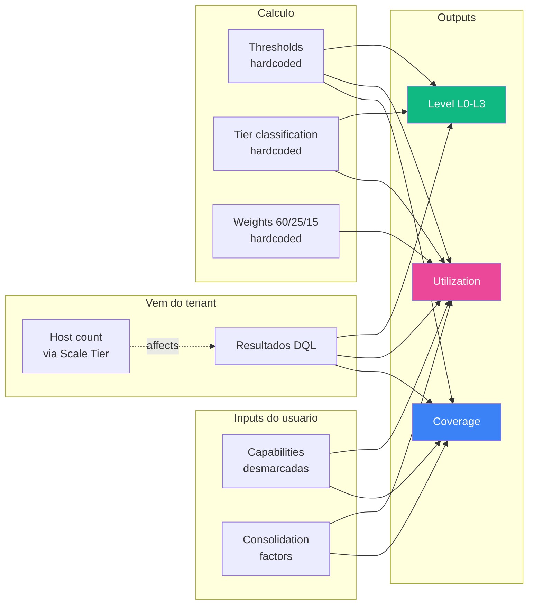

| O que muda Coverage e Utilization | O que NAO muda |
|---|---|
| Dados reais do Grail (DQL results) | Tema dark/light |
| Scale Tier (large/xlarge faz sampling) | Cache hit/miss (resultado e igual) |
| Capabilities desmarcadas | Versao do app (mesmas formulas em 2.5.x) |
| Consolidation factor (so afeta adjusted) | Tempo de execucao |
| Thresholds (se alguem editar queries.ts) | DPS scanned bytes |
| Tier classification (se alguem editar criterionTiers.ts) | |

---

## 8. TLDR visual

Os dois caminhos em uma imagem.

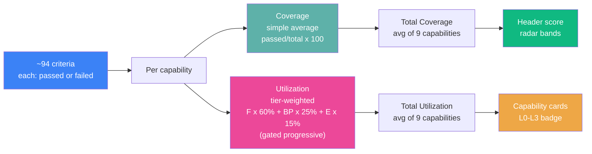

> **Em uma frase:** *Coverage e media simples; Utilization e media ponderada que so libera tiers avancados quando os anteriores estao solidos.*

---

## Como exportar como PNG

```bash
npm i -g @mermaid-js/mermaid-cli   # uma vez
cd docs
mmdc -i SCORING-CALCULATIONS.md -o diagrams-scoring/ -e png -w 1600 -b white
```

Ou regenerar exatamente o mesmo set:

```bash
python3 /tmp/extract_diagrams.py     # adapt source filename to this MD
cd docs/diagrams-scoring
for f in *.mmd; do
  /tmp/node_modules/.bin/mmdc -i "$f" -o "${f%.mmd}.png" \
    -c /tmp/mermaid-config.json -b white -w 1600
done
```
